# Signal Equalizer Web Application

## About the Project
This web application is a comprehensive signal equalizer developed for a Digital Signal Processing course. It allows users to manipulate audio signals in the frequency domain through various equalization modes. The application supports both generic frequency band manipulation and specialized modes for musical instruments, animal sounds, and human voices. With synchronized signal viewers, spectrogram visualization, and AI-powered equalization options, this tool provides a complete environment for audio signal processing and analysis.

## Getting Started

### Prerequisites
- Python 3.8 or higher
- Node.js 14.0 or higher
- npm or yarn package manager

### Installation

1. **Clone the repository**
```bash
git clone https://github.com/MazenAtlam/signal_equalizer.git
cd signal-equalizer
```

2. **Backend Setup**
```bash
cd BackEnd
pip install -r requirements.txt
```
For MP3 support in pydub:

On Ubuntu/Debian
```bash
sudo apt-get install ffmpeg
```

On macOS
```bash
brew install ffmpeg
```
3. **Frontend Setup**
```bash
cd FrontEnd
npm install
```

4. **Run the Application**
    - Start backend server:
   ```bash
   cd Backend
   python app.py
   ```
    - Start frontend development server:
   ```bash
   cd FrontEnd
   npm run dev
   ```

5. **Access the Application**
   Open your browser and navigate to `http://localhost:5001`

## Usage Examples

### Generic Mode
1. Upload an audio file (WAV/MP3 format)
2. Click "Add Band" to create frequency bands
3. Adjust frequency range and scale (0-4) for each band
4. Save your equalizer scheme for future use
5. Listen to the modified signal in real-time

### Customized Mode - Musical Instruments
1. Select "Musical Instruments" from the category dropdown
2. Upload a mixed audio file containing at least 4 instruments
3. Use individual sliders to adjust each instrument's volume
4. Compare input vs output using synchronized viewers
5. Toggle between linear and audiogram frequency scales

### AI-Powered Equalization
1. Select either "Human Voices" or "Musical Instruments" mode
2. Click "AI Equalize" button
3. The pre-trained model will automatically separate and equalize components
4. Compare results with traditional equalizer method

## Technologies Used

### Frontend
- React.js for UI components
- Vanilla JavaScript for signal processing algorithms
- HTML5/CSS3 for structure and styling
- Bootstrap for responsive design

### Backend
- Python Flask/FastAPI for server-side processing
- Custom FFT implementation (no external libraries)
- NumPy for numerical computations
- Demucs for source separation (AI mode)
- Multi-Decoder-DPRNN for voice separation

### Audio Processing
- Custom Fourier Transform implementation
- Manual spectrogram calculation
- Web Audio API for real-time playback
- File handling for WAV/MP3 formats

## Features Explanation

### Core Functionality
- **Dual Domain Visualization**: Simultaneous time-domain and frequency-domain views
- **Custom FFT Implementation**: Manual implementation of Fourier Transform without external libraries
- **Real-time Processing**: Immediate audio modification with slider adjustments

### Equalizer Modes
1. **Generic Mode**: User-defined frequency subdivisions with customizable ranges and scaling
2. **Customized Modes**:
    - Musical Instruments: Isolate and adjust individual instruments
    - Animal Sounds: Separate and modify specific animal vocalizations
    - Human Voices: Distinguish between different speakers based on gender, age, and language

### Visualization Tools
- **Linked Cine Viewers**: Two synchronized signal viewers with play/pause/stop/speed control
- **Dual Spectrograms**: Input and output spectrograms showing frequency intensity over time
- **Scale Options**: Toggle between linear and audiogram (logarithmic) frequency scales
- **Audio Playback**: Listen to both original and processed signals

### Advanced Features
- **Scheme Management**: Save and load equalizer configurations
- **AI Integration**: Pre-trained models for enhanced separation in selected modes
- **Performance Comparison**: Compare traditional equalizer results with AI model outputs
- **Responsive UI**: Consistent interface across different modes with dynamic slider generation

## Website Walkthrough

Home Page
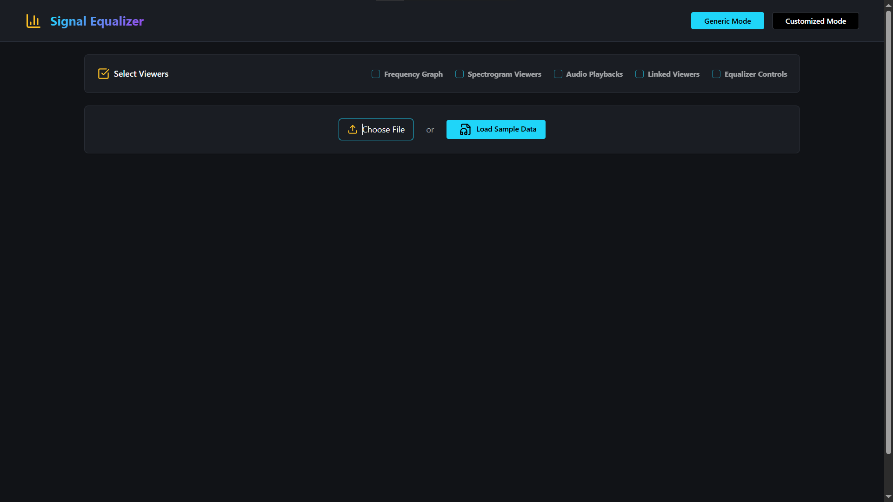

Uploading and File Processing
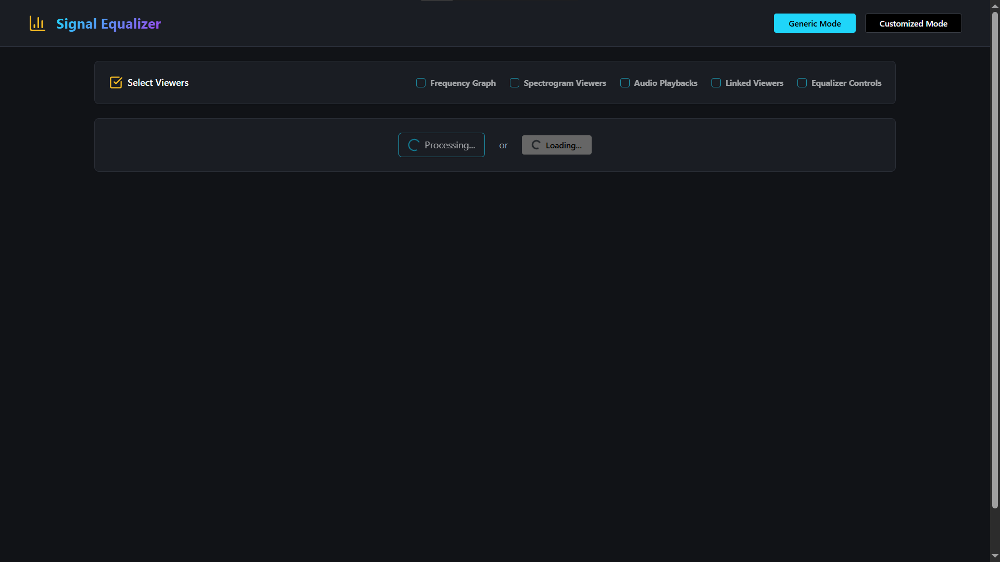

Frequency Graph Linear Scale
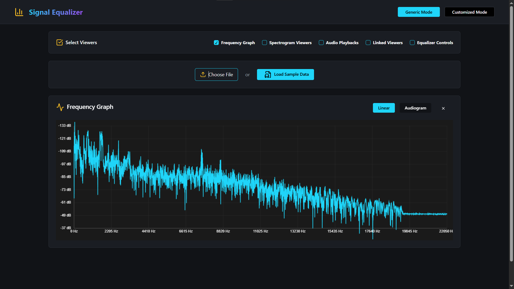

Frequency Graph Audiogram Scale
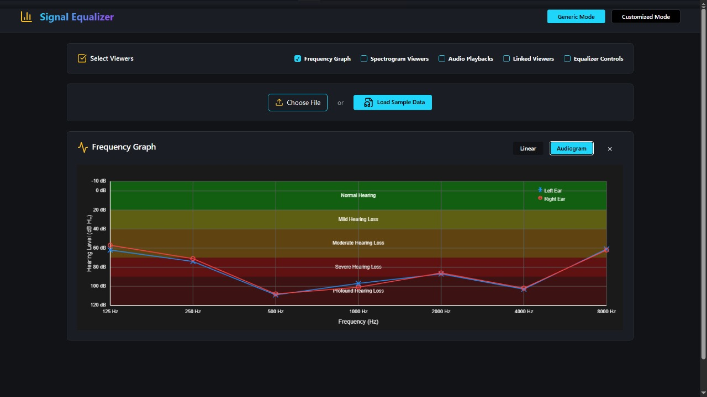

Spectrogram in Generic Mode
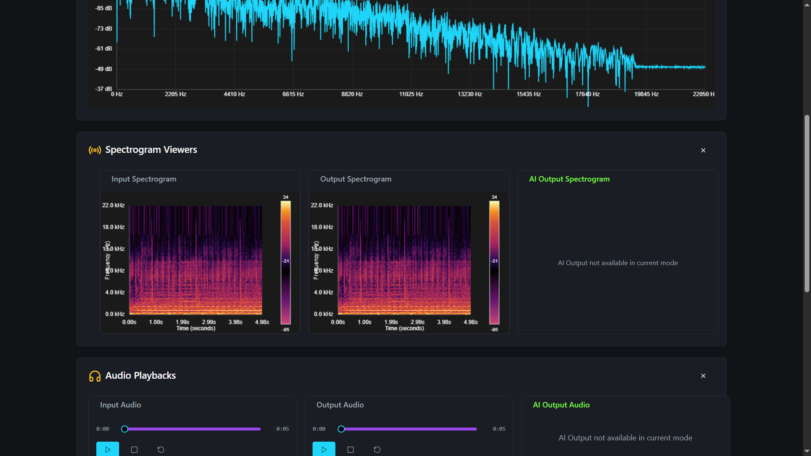

Audio Playback in Generic Mode
[Audio Playback in Generic Mode](https://github.com/user-attachments/assets/a955f765-2cf4-4aa1-87fe-bf1c248f143b)

Linked Viewers in Generic Mode
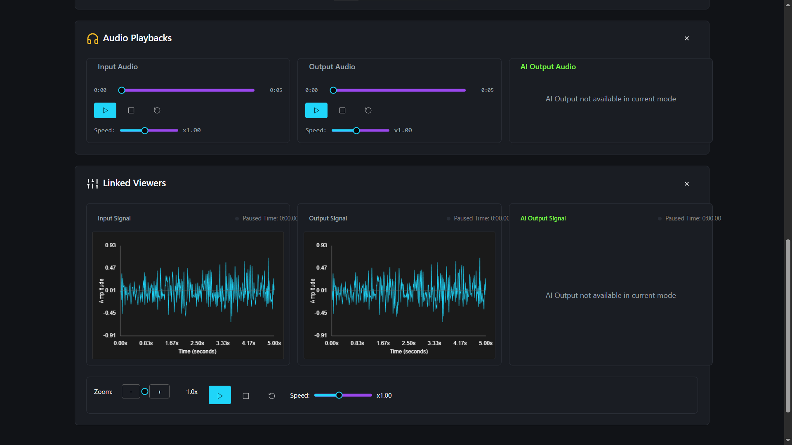

Equalizer in Generic Mode
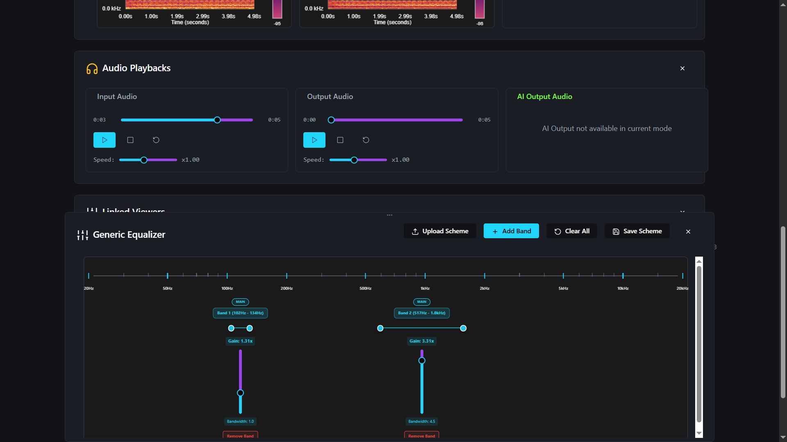

Equalizer of Human Voices Category in Customized Mode
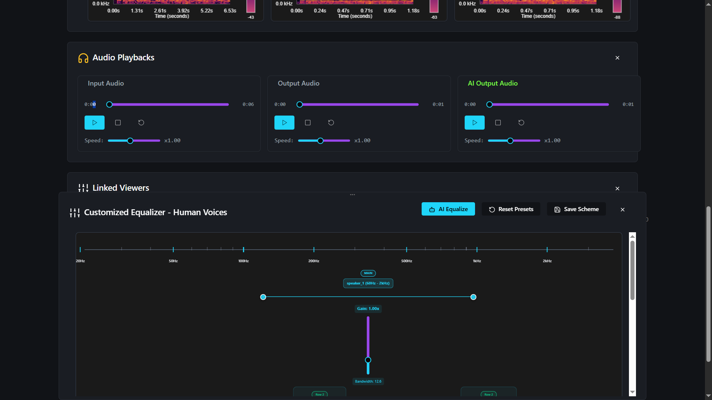
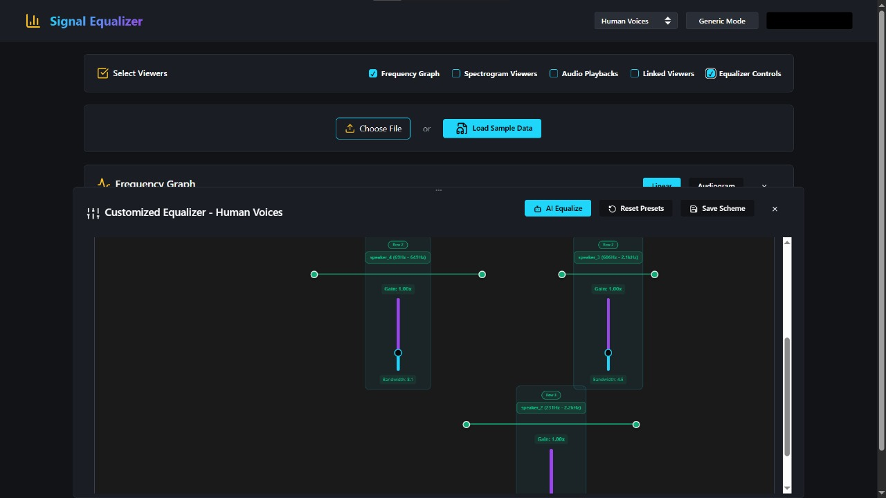

Spectrogram of Human Voices in Customized Mode
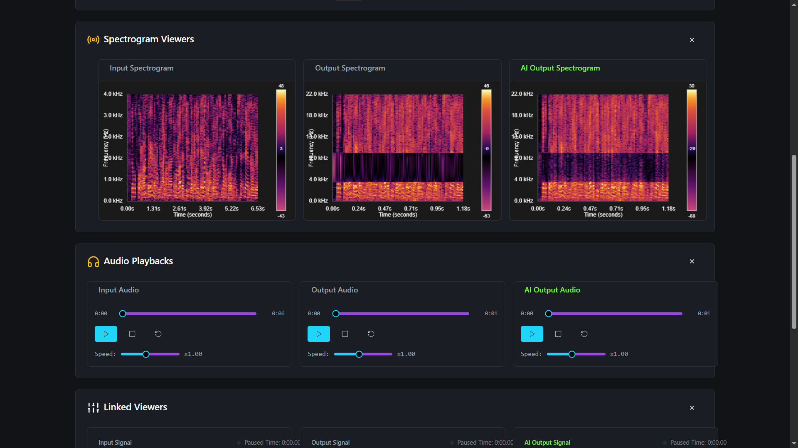

Linked Viewers of Human Voices in Customized Mode
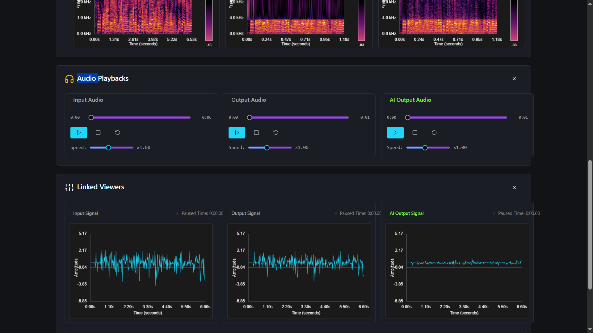

Equalizer of Animal Sounds Category in Customized Mode
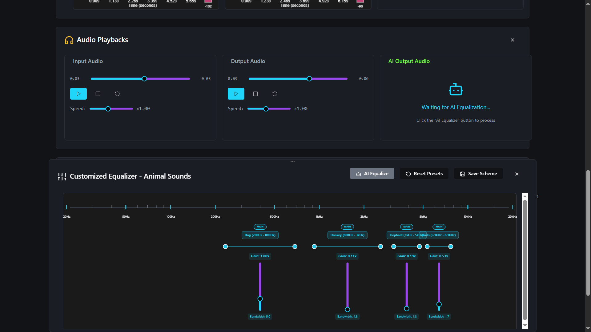

Spectrogram of Animal Sounds in Customized Mode
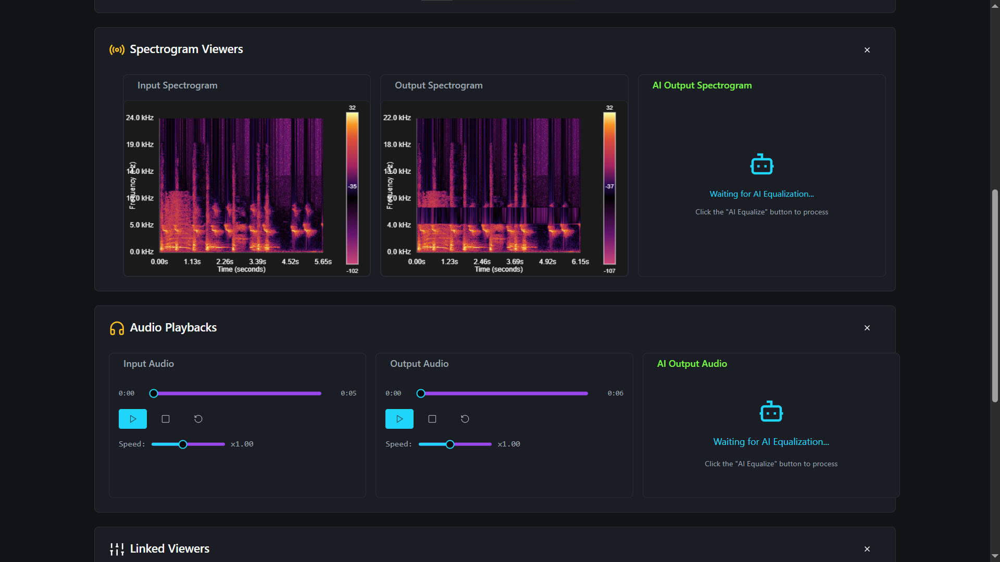

Audio Playback of Animal Sounds in Customized Mode
[Audio Playback of Animal Sounds in Customized Mode](https://github.com/user-attachments/assets/da7448fa-6429-49f3-b3df-03f3c06b777f)

Linked Viewers of Animal Sounds in Customized Mode
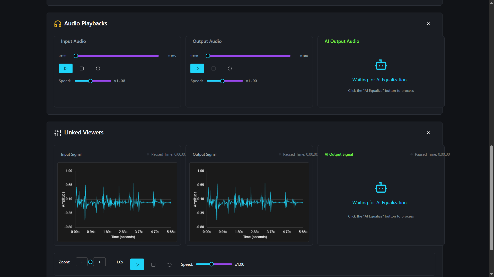

Equalizer of Musical Instruments Category in Customized Mode
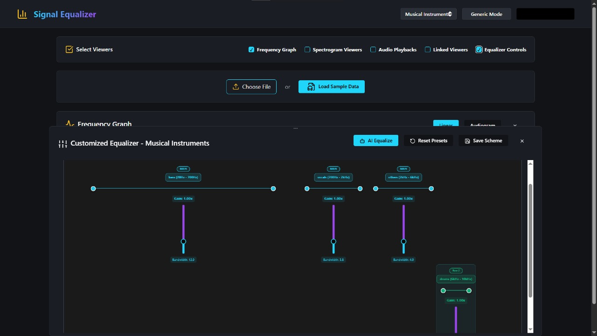

Spectrogram of Musical Instruments in Customized Mode
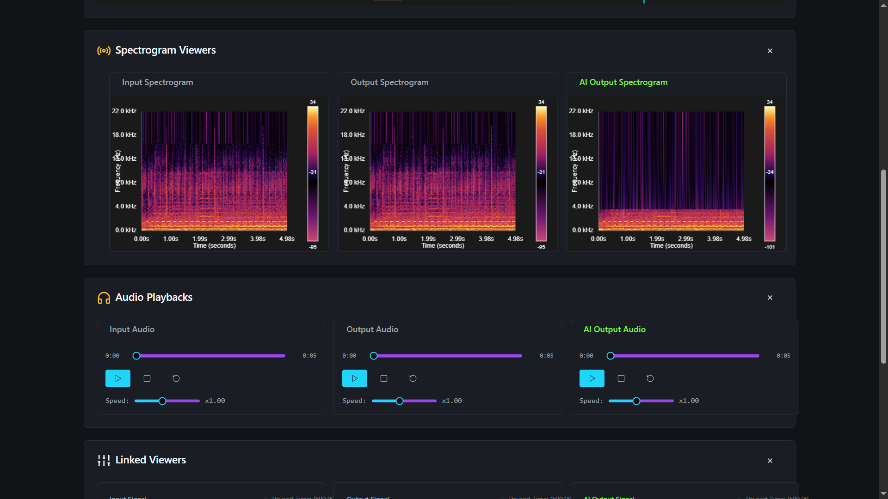

Audio Playback of Musical Instruments in Customized Mode
[Audio Playback of Musical Instruments in Customized Mode](https://github.com/user-attachments/assets/e819b356-dbdb-4266-a736-d6c09e4685fc)

Linked Viewers of Musical Instruments in Customized Mode
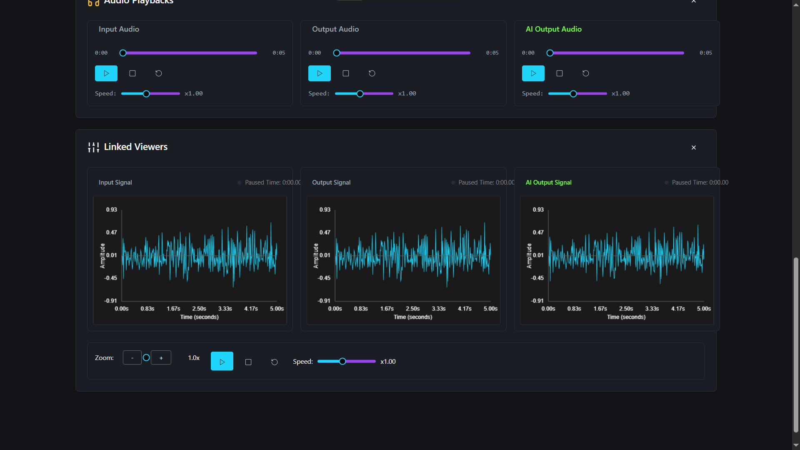

## License
This project is licensed under the MIT License - see the LICENSE file for details.

## Acknowledgments
- Digital Signal Processing course instructors for project guidance
- Open-source community for various audio processing insights
- Research papers on source separation and equalization techniques
- Contributors to the Demucs and DPRNN models used in AI mode
